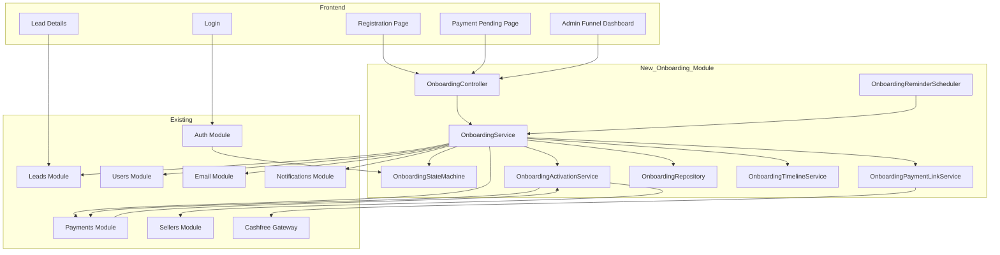
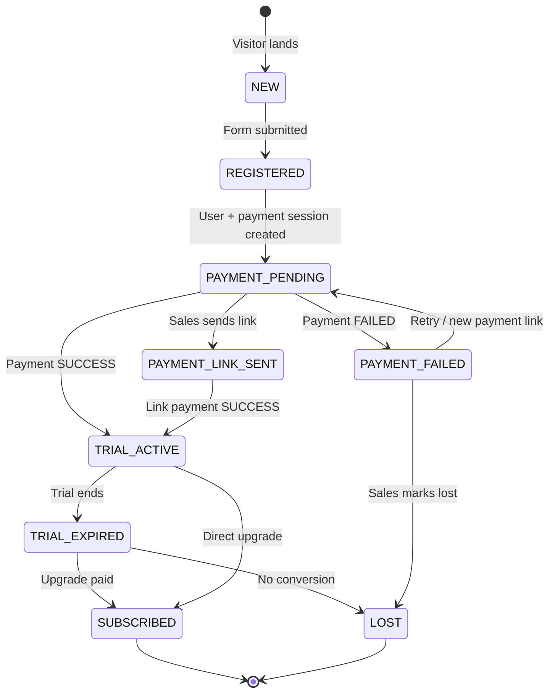
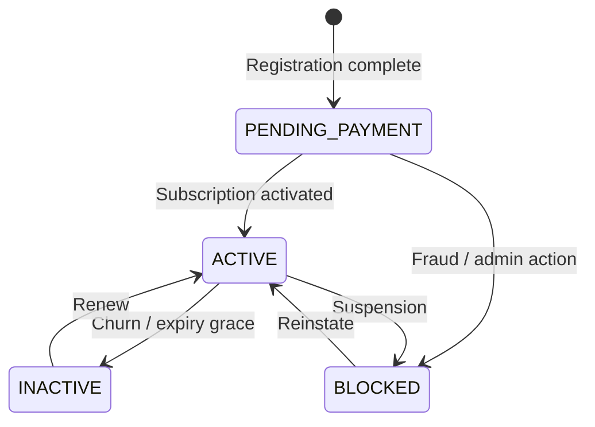
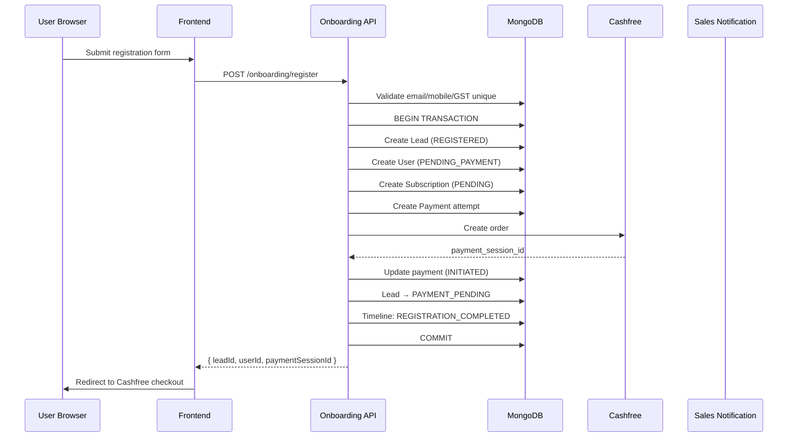
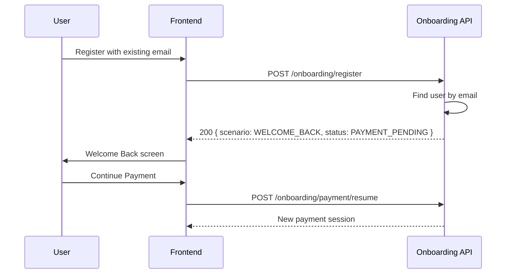
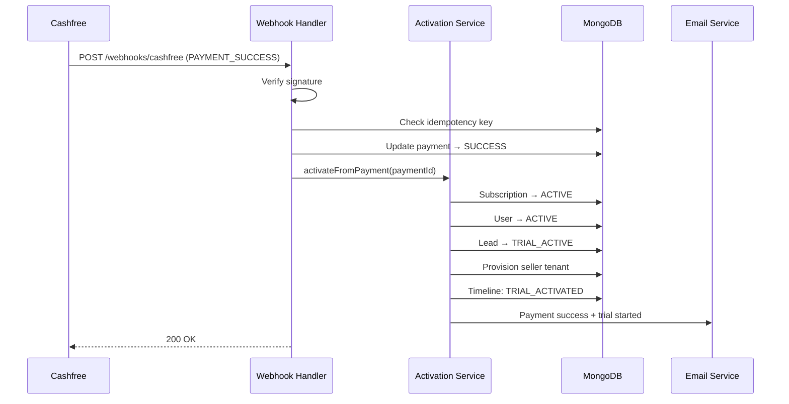
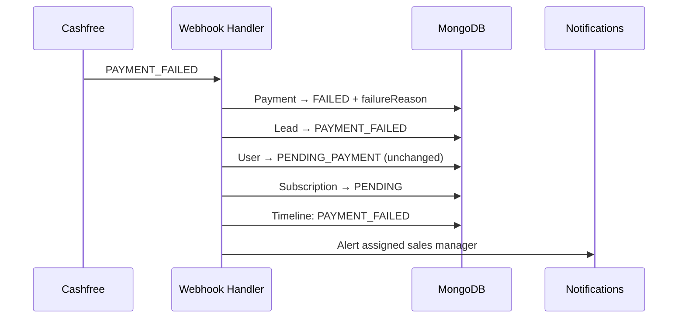
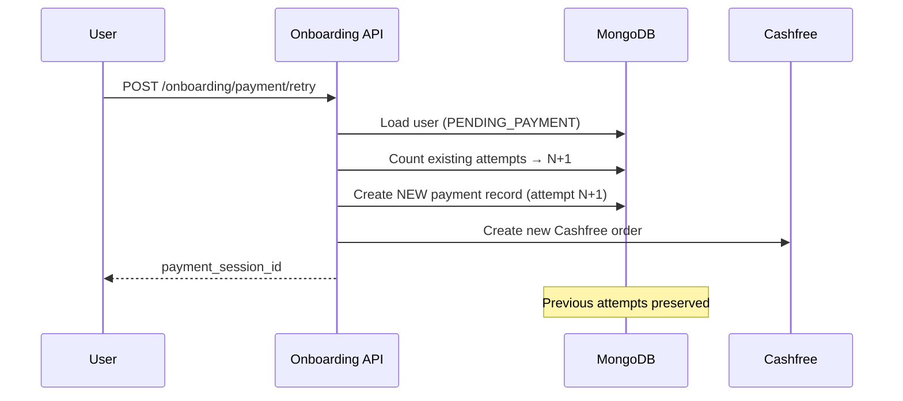
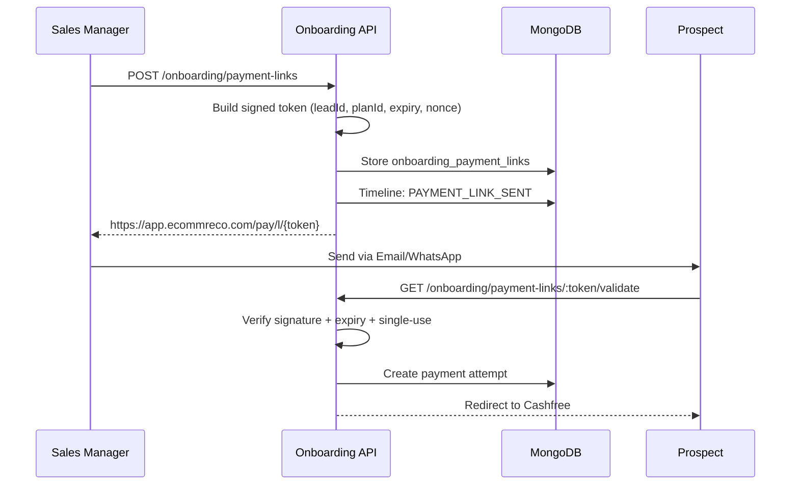

# EcommReco — Onboarding, Trial & Payment Redesign

**Version:** 1.0 (Pre-implementation)  
**Status:** Awaiting approval  
**Stack:** NestJS 11 · MongoDB · React/Vite · Cashfree PG

---

## 1. Executive Summary

The current platform runs **three disconnected commercial flows**:

| Flow | Entry | Problem |
|------|-------|---------|
| Sales-led CRM | `POST /leads/register` | Rich CRM, placeholder payment links |
| Self-service trial | `POST /trial/register` | Creates seller immediately; payment failure = dead end |
| Cashfree engine | `POST /payments/create-order` | Solid PG layer, not unified with leads |

**Goal:** Replace the trial onboarding path with a **state-machine-driven, lead-centric architecture** where registration always succeeds, payment is retryable, sales can follow up, and existing paid customers are untouched.

**Principle:** Do not patch — introduce a new `onboarding` domain module and migrate trial traffic to it while legacy paths remain for existing data.

---

## 2. Current State Analysis

### 2.1 Impacted Modules

#### Backend (`ecommreco-backend/src/`)

| Module | Impact | Action |
|--------|--------|--------|
| `trial/` | **High** | Replace with `onboarding/` orchestration; keep read-only compat layer |
| `payments/` | **Medium** | Extend payment model; webhook routes to onboarding activator |
| `leads/` | **High** | Extend schema + status enum; unify trial leads |
| `auth/` | **Medium** | Login policy reads onboarding state, not scattered seller flags |
| `sellers/` | **Low** | Remain source of truth for tenant data; linked via `userId` |
| `users/` | **Medium** | Extend for `PENDING_PAYMENT` status + `leadId` link |
| `subscription/` | **Low** | Package catalog unchanged; assignment flows untouched |
| `account-manager/` | **Low** | Sales-led path unchanged |
| `email/` | **Medium** | New templates + reminder scheduler |
| `notifications/` | **Medium** | Sales alerts on payment failed/abandoned |

#### Frontend (`ecommreco-frontend/src/`)

| Area | Impact | Action |
|------|--------|--------|
| `pages/auth/Register.tsx` | **High** | Split trial vs lead; welcome-back for pending payment |
| `pages/trial/*` | **High** | Replace with `pages/onboarding/*` |
| `components/auth/TrialAccessGuard` | **Medium** | Generalize to `OnboardingAccessGuard` |
| `pages/superadmin/leads/*` | **High** | Lead details: payment history, timeline, payment links |
| `pages/superadmin/payments/*` | **Medium** | Funnel widgets |
| `services/trialService.ts` | **High** | Replace with `onboardingService.ts` |
| Sales manager leads UI | **High** | Payment link generation, follow-ups |

### 2.2 Dependency Map



### 2.3 What Must NOT Break

| Customer type | Identifier | Protection |
|---------------|------------|------------|
| Sales-onboarded paid sellers | `isTrial: false`, `onboardingStatus: active/training_*` | No migration; auth reads legacy path |
| Converted trial sellers | `trialStatus: converted`, `convertedToPaid: true` | Map to `SUBSCRIBED` in new enum only |
| Active trial sellers | `trialStatus: active`, `paymentStatus: paid` | Backfill to new tables; keep access |
| CRM leads in pipeline | `leads` collection | Extend, never rewrite |
| Existing `payment_orders` | Historical records | Immutable; new attempts append |

---

## 3. Target Architecture

### 3.1 Domain Separation

```
Registration  ≠  Payment  ≠  Subscription  ≠  Activation
```

Each is an independent aggregate with explicit transitions orchestrated by `OnboardingStateMachine`.

### 3.2 State Machine (Lead-centric)



### 3.3 User Access State (parallel)



**Rule:** Dashboard access only when `User.status === ACTIVE` AND `Subscription.status === ACTIVE`.

---

## 4. Database Design

### 4.1 Strategy: Extend + New Collections (No Deletes)

MongoDB collections — **never drop or rewrite** existing data.

| Collection | Decision |
|------------|----------|
| `leads` | **Extend** with new `onboardingStatus`, `userId`, `leadNumber` |
| `users` | **Extend** with `leadId`, `onboardingUserStatus` |
| `sellers` | **Keep** as tenant aggregate; add `onboardingUserId` optional FK |
| `payment_orders` | **Keep** as payment attempts; add `leadId`, `attemptNumber` |
| `payment_transactions` | **Keep**; link to attempts |
| `seller_subscriptions` | **Keep** for paid subs |
| `trial_subscriptions` | **Freeze**; new trials use unified subscription |
| `onboarding_timeline` | **New** — immutable activity log |
| `onboarding_payment_links` | **New** — signed tokens, single-use |
| `onboarding_reminders` | **New** — scheduled reminder queue |

### 4.2 Lead (extend `leads`)

```typescript
// New / normalized fields on existing Lead schema
leadNumber: string;          // LED-202607-XXXX (human readable)
onboardingStatus: enum;      // NEW | REGISTERED | PAYMENT_PENDING | ...
userId?: ObjectId;           // → users
sellerId?: ObjectId;         // → sellers (after activation)
country?: string;
assignedTo?: ObjectId;       // sales manager
source: string;               // self_service_trial | website | manual | ...
remarks?: string;
lastPaymentAttemptAt?: Date;
abandonedCheckoutAt?: Date;
convertedAt?: Date;
```

**Status enum (new canonical field `onboardingStatus`):**

`NEW` → `REGISTERED` → `PAYMENT_PENDING` → `PAYMENT_FAILED` | `PAYMENT_LINK_SENT` → `TRIAL_ACTIVE` → `TRIAL_EXPIRED` → `SUBSCRIBED` | `LOST`

Legacy fields (`pipelineStage`, `leadStatus`, `status`) remain for sales-led leads; sync via adapter on write.

### 4.3 User (extend `users`)

```typescript
leadId?: ObjectId;
sellerId?: ObjectId;          // populated after tenant provisioned
onboardingUserStatus: enum;  // PENDING_PAYMENT | ACTIVE | BLOCKED | INACTIVE
isEmailVerified: boolean;
registrationSource: string;
lastLoginAt?: Date;
```

**Note:** Trial registration currently creates `sellers` only. New flow: **always create `users` first**, then seller stub on activation.

### 4.4 Subscription (unify in `seller_subscriptions`)

Extend existing schema:

```typescript
userId: string;              // new FK
leadId?: string;
onboardingSubscriptionStatus: enum; // PENDING | ACTIVE | EXPIRED | FAILED | CANCELLED
activationSource: enum;      // self_checkout | payment_link | sales_assisted
```

Trial subscriptions: `subscriptionType: 'trial'`, `trial: true`.

### 4.5 Payment Attempts (extend `payment_orders`)

Each retry = **new document**. Never update previous attempt's gateway IDs.

```typescript
leadId?: string;
userId: string;
subscriptionId?: string;
attemptNumber: number;        // 1, 2, 3...
gateway: 'cashfree';
gatewayOrderId: string;
gatewayPaymentId?: string;
paymentStatus: enum;          // CREATED | INITIATED | PENDING | SUCCESS | FAILED | CANCELLED | EXPIRED
failureReason?: string;
paymentResponse?: object;
idempotencyKey: string;       // unique per attempt
webhookProcessedAt?: Date;
signatureVerified: boolean;
```

### 4.6 Payment Link Tokens (`onboarding_payment_links`)

```typescript
token: string;               // opaque URL token (not JWT in URL)
leadId: ObjectId;
userId: ObjectId;
planId: ObjectId;
linkType: 'trial' | 'subscription' | 'custom';
amount?: number;             // for custom
nonce: string;
expiresAt: Date;
usedAt?: Date;
revokedAt?: Date;
createdBy: ObjectId;         // sales manager
signature: string;           // HMAC-SHA256(payload, secret)
metadata?: object;
```

### 4.7 Timeline (`onboarding_timeline`)

```typescript
leadId: ObjectId;
userId?: ObjectId;
eventType: string;           // REGISTRATION_COMPLETED | PAYMENT_STARTED | ...
message: string;
payload?: object;
actorId?: ObjectId;
actorRole?: string;
createdAt: Date;
```

---

## 5. Migration Strategy

### Phase 0 — Preparation (no runtime change)

1. Add new fields with defaults to schemas (nullable / optional).
2. Create indexes:
   - `leads.onboardingStatus`
   - `leads.userId`
   - `payment_orders.leadId + attemptNumber`
   - `onboarding_payment_links.token` (unique)
   - `onboarding_timeline.leadId + createdAt`
3. Deploy schema changes — **zero downtime**.

### Phase 1 — Backfill Script (`scripts/migrate-onboarding-v1.js`)

| Source | Target mapping |
|--------|----------------|
| `sellers` where `isTrial: true`, `trialStatus: pending_payment` | Create `users` + `leads` + timeline entry |
| `sellers` where `trialStatus: active` | Backfill as `TRIAL_ACTIVE` |
| `sellers` where `convertedToPaid` | `SUBSCRIBED` |
| `trial_subscriptions` | Link to lead via `sellerId` |
| `payment_orders` with `metadata.checkoutType: trial_registration` | Set `leadId`, compute `attemptNumber` |

**Rules:**
- Idempotent (`migrationVersion` flag on each record)
- Dry-run mode
- Log conflicts to `onboarding_migration_log`
- Never delete source records

### Phase 2 — Dual Write

New registrations write to **both** old trial tables (compat) and new onboarding tables for 2 weeks.

### Phase 3 — Cutover

Feature flag `ONBOARDING_V2_ENABLED=true` routes:
- `POST /trial/register` → proxies to `POST /onboarding/register`
- Frontend uses new pages

### Phase 4 — Deprecate

After 30 days stable:
- Mark `trial/` endpoints `@Deprecated`
- Read-only access to `trial_subscriptions` for audit

---

## 6. Backward Compatibility

| API | During migration | After cutover |
|-----|------------------|---------------|
| `POST /trial/register` | Proxy → onboarding | Deprecated, 301 |
| `POST /trial/payment/:id/init` | Proxy → resume payment | Deprecated |
| `GET /trial/me/status` | Adapter reads new state | Adapter |
| Sales `POST /leads/register` | Unchanged | Unchanged |
| `POST /payments/create-order` | Unchanged for paid sellers | Unchanged |
| Account manager onboarding | Unchanged | Unchanged |

**Auth:** `trial-login.policy.ts` replaced by `onboarding-access.policy.ts` that checks:
1. New `users.onboardingUserStatus` if `onboardingUserId` present
2. Else fall back to legacy `seller.trialStatus` / `onboardingStatus`

---

## 7. Sequence Diagrams

### 7.1 New Registration (email not found)



### 7.2 Duplicate Registration (pending payment)



### 7.3 Payment Success (webhook)



### 7.4 Payment Failed



### 7.5 Payment Retry



### 7.6 Sales Payment Link



---

## 8. API Specification (v2)

Base path: `/api/v1/onboarding`

### 8.1 Public

| Method | Path | Description |
|--------|------|-------------|
| `POST` | `/register` | Register or return welcome-back |
| `POST` | `/payment/resume` | Resume pending payment (auth optional via email+otp or login) |
| `GET` | `/payment-links/:token` | Validate token + return checkout session |
| `POST` | `/payment-links/:token/checkout` | Create order from token |

**POST /onboarding/register**

```json
// Request
{
  "fullName": "string",
  "companyName": "string",
  "email": "string",
  "mobile": "string",
  "password": "string",
  "panNumber": "string",
  "gstNumber": "string",
  "city": "string",
  "state": "string",
  "source": "self_service_trial",
  "acceptTerms": true
}

// Response — new registration
{
  "success": true,
  "scenario": "NEW_REGISTRATION",
  "data": {
    "leadId": "...",
    "userId": "...",
    "leadNumber": "LED-202607-A1B2",
    "paymentSessionId": "...",
    "orderId": "...",
    "totalAmount": 588.82,
    "redirectUrl": "/onboarding/payment"
  }
}

// Response — existing pending payment
{
  "success": true,
  "scenario": "WELCOME_BACK",
  "data": {
    "leadId": "...",
    "userId": "...",
    "status": "PAYMENT_PENDING",
    "message": "Your registration is complete. Payment is still pending.",
    "actions": ["CONTINUE_PAYMENT", "FORGOT_PASSWORD"]
  }
}
```

### 8.2 Authenticated (user)

| Method | Path | Description |
|--------|------|-------------|
| `GET` | `/me/status` | Onboarding + subscription status |
| `POST` | `/payment/retry` | New payment attempt |
| `GET` | `/payment/history` | All attempts for user |
| `POST` | `/contact-sales` | CRM activity + notify assigned SM |

### 8.3 Webhook

| Method | Path | Description |
|--------|------|-------------|
| `POST` | `/webhooks/cashfree` | Existing; routes to `OnboardingActivationService` |

### 8.4 Sales / Admin

| Method | Path | Roles | Description |
|--------|------|-------|-------------|
| `GET` | `/leads` | super_admin, sales_manager | Search + filters |
| `GET` | `/leads/:id` | super_admin, sales_manager | Full lead detail |
| `GET` | `/leads/:id/timeline` | super_admin, sales_manager | Activity log |
| `GET` | `/leads/:id/payments` | super_admin, sales_manager | Payment attempts |
| `PATCH` | `/leads/:id/assign` | super_admin, sales_manager | Assign lead |
| `PATCH` | `/leads/:id/status` | super_admin, sales_manager | Manual status |
| `POST` | `/leads/:id/notes` | super_admin, sales_manager | Add note |
| `POST` | `/leads/:id/follow-ups` | sales_manager | Schedule follow-up |
| `POST` | `/payment-links` | sales_manager | Generate signed link |
| `POST` | `/payment-links/:id/resend` | sales_manager | Resend link |
| `GET` | `/analytics/funnel` | super_admin | Funnel metrics |
| `GET` | `/reports/payment-failures` | super_admin | Failure report |
| `GET` | `/reports/abandoned-checkout` | super_admin | Abandoned report |
| `GET` | `/reports/trial-conversion` | super_admin | Conversion report |

---

## 9. Frontend Pages

| Page | Route | Purpose |
|------|-------|---------|
| Trial Registration | `/onboarding/register` | Form + welcome-back |
| Payment Checkout | `/onboarding/payment` | Cashfree embed / redirect |
| Payment Pending | `/onboarding/payment-pending` | Post-login blocked state |
| Payment Success | `/onboarding/payment/success` | Confirmation |
| Payment Failed | `/onboarding/payment/failed` | Retry + contact sales |
| Trial Activated | `/onboarding/activated` | First login welcome |
| Payment Link Landing | `/pay/l/:token` | Sales-generated link |
| Lead Details (enhanced) | `/super-admin/leads/:id` | Timeline, payments, links |
| Onboarding Funnel | `/super-admin/onboarding/analytics` | Funnel widgets |
| Sales Lead Workspace | `/sales-manager/leads/:id` | Assign, notes, payment link |

---

## 10. Security Requirements

| Requirement | Implementation |
|-------------|----------------|
| Webhook signature | Existing `CashfreeGateway.verifyWebhookSignature` |
| Idempotent webhooks | `payment_logs` + unique `idempotencyKey` per event |
| Payment link integrity | HMAC-SHA256(`leadId\|userId\|planId\|expiry\|nonce`, secret) |
| Single-use links | `usedAt` set atomically on first checkout |
| Replay prevention | Nonce stored; reject duplicate nonce |
| Rate limiting | `@Throttle` on register (5/min/IP), payment create (10/hr/user) |
| Audit | All state transitions → `onboarding_timeline` |
| Transactions | MongoDB sessions for register + activate |
| PII | Encrypt payment link tokens at rest (optional AES-256-GCM) |

---

## 11. Email & Reminder Engine

### Templates (new)

| Template | Trigger |
|----------|---------|
| `onboarding-registration-success` | After register |
| `onboarding-payment-success` | Webhook SUCCESS |
| `onboarding-payment-failed` | Webhook FAILED |
| `onboarding-payment-reminder` | Scheduler |
| `onboarding-payment-link` | Sales sends link |
| `onboarding-trial-started` | Activation |
| `onboarding-trial-ending` | 3 days, 1 day before expiry |
| `onboarding-trial-expired` | Trial end |

### Reminder Schedule (configurable via `onboarding_reminder_config`)

Default for `PAYMENT_PENDING`:
- +1 hour (email)
- +24 hours (email + optional SMS)
- +48 hours (email + WhatsApp if configured)
- +72 hours (email + notify sales)

Stop when: `Lead.onboardingStatus !== PAYMENT_PENDING|PAYMENT_FAILED` OR user pays.

---

## 12. Admin Funnel Dashboard

Widgets (counts + conversion %):

```
Visitors (analytics) 
  → Registrations 
    → Payment Pending 
      → Payment Failed 
        → Trial Active 
          → Converted (SUBSCRIBED)
            → Expired / Lost
```

Data source: `onboarding_timeline` aggregations + `leads.onboardingStatus` snapshot counts.

---

## 13. Implementation Phases

### Phase 1 — Foundation (Week 1–2)
- [ ] New schemas + indexes + migration script (dry-run)
- [ ] `onboarding` NestJS module skeleton (repository, DTOs, state machine)
- [ ] `OnboardingTimelineService`
- [ ] Feature flag `ONBOARDING_V2_ENABLED`
- [ ] Unit tests for state machine + payment link signing

### Phase 2 — Registration & Resume (Week 2–3)
- [ ] `POST /onboarding/register` with welcome-back logic
- [ ] `POST /onboarding/payment/resume` + `retry`
- [ ] Frontend: registration, payment pending, welcome-back screens
- [ ] Auth policy v2 with legacy fallback
- [ ] Dual-write from old trial register

### Phase 3 — Webhook & Activation (Week 3–4)
- [ ] Refactor webhook → `OnboardingActivationService`
- [ ] Idempotent activation pipeline
- [ ] Seller tenant provisioning on activation
- [ ] Payment success/failed emails
- [ ] Sales notification on failure

### Phase 4 — Sales & CRM (Week 4–5)
- [ ] Payment link generation + validation
- [ ] Enhanced lead detail (timeline, payments, notes)
- [ ] Contact sales → CRM activity
- [ ] Lead assignment + follow-ups integration

### Phase 5 — Reminders & Analytics (Week 5–6)
- [ ] Reminder scheduler
- [ ] Funnel dashboard
- [ ] Reports (failure, abandoned, conversion)
- [ ] SMS/WhatsApp adapter interfaces (stub + email first)

### Phase 6 — Migration & Cutover (Week 6–7)
- [ ] Run backfill on staging → UAT → production
- [ ] Enable feature flag
- [ ] Deprecate old trial endpoints
- [ ] Monitor + rollback plan

### Phase 7 — Hardening (Week 7–8)
- [ ] Load testing payment creation
- [ ] Security review (signatures, rate limits)
- [ ] E2E tests (register → fail → retry → success → login)
- [ ] Documentation + runbooks

---

## 14. Module Structure (Backend)

```
src/onboarding/
├── onboarding.module.ts
├── onboarding.controller.ts
├── onboarding-admin.controller.ts
├── onboarding-payment-link.controller.ts
├── services/
│   ├── onboarding.service.ts
│   ├── onboarding-state-machine.service.ts
│   ├── onboarding-registration.service.ts
│   ├── onboarding-payment.service.ts
│   ├── onboarding-activation.service.ts
│   ├── onboarding-payment-link.service.ts
│   ├── onboarding-timeline.service.ts
│   ├── onboarding-reminder.scheduler.ts
│   └── onboarding-analytics.service.ts
├── repositories/
│   ├── lead.repository.ts
│   ├── user.repository.ts
│   ├── payment-attempt.repository.ts
│   └── subscription.repository.ts
├── policies/
│   └── onboarding-access.policy.ts
├── dto/
├── schemas/
│   ├── onboarding-timeline.schema.ts
│   └── onboarding-payment-link.schema.ts
└── constants/
    └── onboarding-status.ts
```

---

## 15. Open Decisions (Need Approval)

| # | Decision | Recommendation |
|---|----------|----------------|
| 1 | Separate `onboarding_users` vs extend `users` | **Extend `users`** — avoids dual auth |
| 2 | Keep `sellers` as tenant root | **Yes** — provision on activation only |
| 3 | SMS/WhatsApp provider | Phase 5 — interface first; Twilio/MessageBird later |
| 4 | Visitor tracking | Integrate GA4 events; funnel uses lead counts |
| 5 | Cutover strategy | Feature flag + dual-write for 2 weeks |
| 6 | Old trial URLs | 301 redirect `/trial/*` → `/onboarding/*` |

---

## 16. Success Criteria

- [ ] Registration never fails due to payment
- [ ] Pending payment user sees welcome-back, not "email exists"
- [ ] Failed payment user can retry unlimited times (new attempts logged)
- [ ] Sales can generate and resend payment links
- [ ] Abandoned checkout recoverable on next login
- [ ] Every action appears in lead timeline
- [ ] Existing paid sellers unaffected (regression suite green)
- [ ] Webhook processing idempotent under duplicate delivery
- [ ] Funnel dashboard shows accurate conversion metrics

---

## 17. Next Step

**Awaiting your approval** on:
1. Database extend-vs-new approach
2. Implementation phase order
3. Open decisions in §15

Once approved, implementation begins with **Phase 1** (schemas + state machine + migration dry-run) without modifying existing paid-customer paths.
